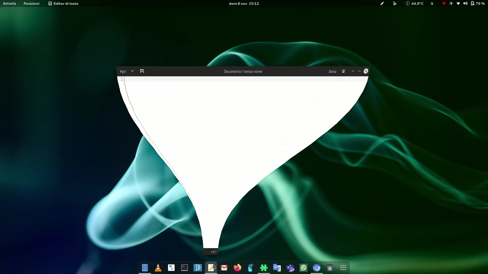

# Compiz alike magic lamp effect for GNOME Shell

## Installation

You can install this extension by visiting [the GNOME Shell Extensions page](https://extensions.gnome.org/extension/3740/compiz-alike-magic-lamp-effect/) for this extension.

