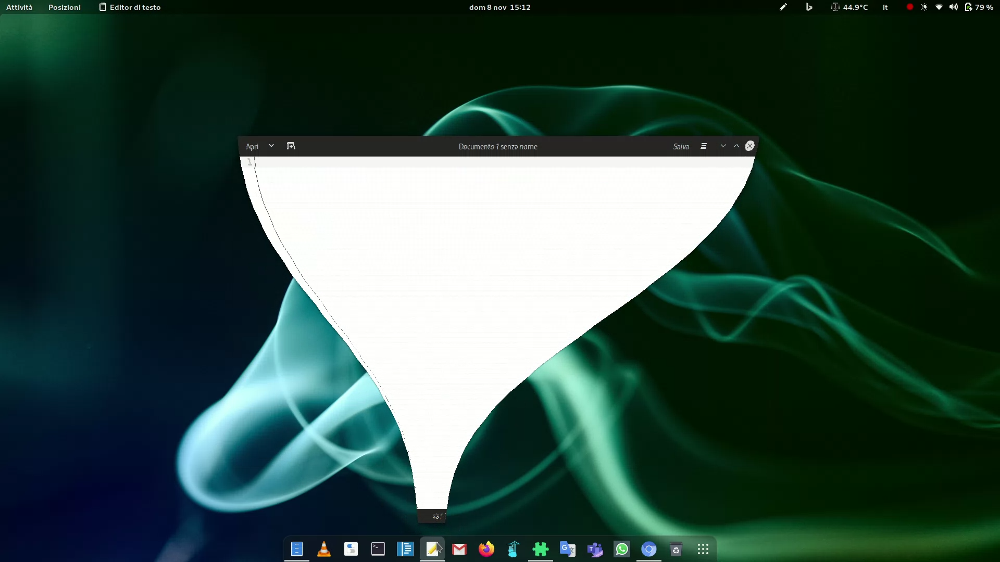

# Compiz alike Magic lamp effect for GNOME 45-50

[](https://extensions.gnome.org/extension/3740/compiz-alike-magic-lamp-effect/)

## Installation

### From GNOME Shell Extensions
You can install this extension by visiting [the GNOME Shell Extensions page](https://extensions.gnome.org/extension/3740/compiz-alike-magic-lamp-effect/).

[](https://extensions.gnome.org/extension/3740/compiz-alike-magic-lamp-effect/)

### Manual Installation (Development)
If you want to install the latest version from source, you can use the included installation script:

1. Clone this repository.
2. Run the installation script:
   ```bash
   bash install.sh
   ```
3. Restart GNOME Shell (X11: `Alt+F2` then `r`, Wayland: Log out and log in).
4. Enable the extension using **Extensions** or **Extension Manager**.
