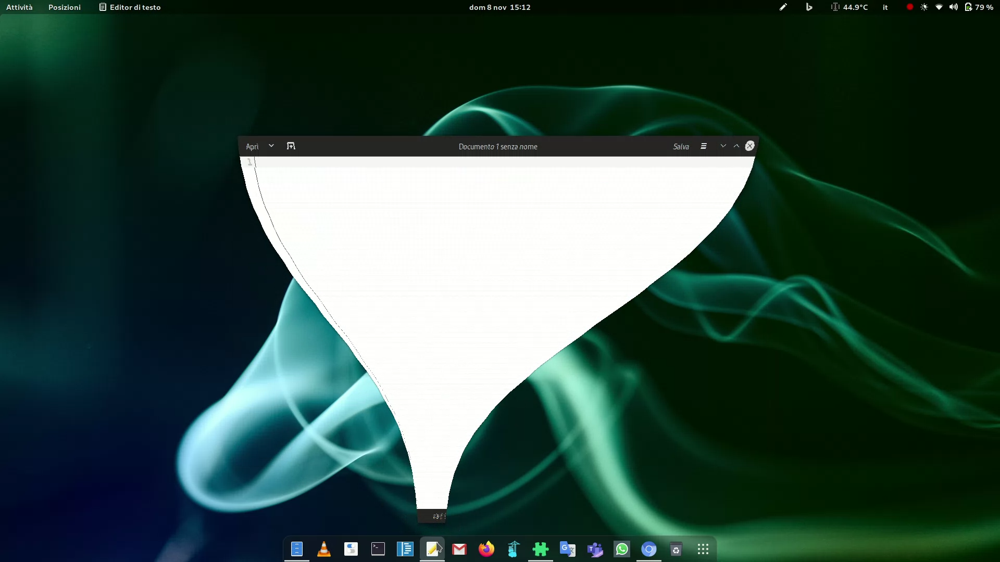

# Compiz alike Magic lamp effect for GNOME 45-50

[](https://extensions.gnome.org/extension/3740/compiz-alike-magic-lamp-effect/)

## Effects

| Effect | Look |
| --- | --- |
| `default` | The Compiz magic lamp: the window funnels into its icon with a slight wave along the edges. |
| `sine` | Same, with a stronger wave. |
| `macos` | The macOS genie: the window keeps its full width at the top, its sides bend into a thin neck at the dock icon, then the whole window slides down the neck in one continuous motion. |

**Easing** controls the speed curve of the animation. `auto` keeps the classic linear timing for `default` and `sine` and uses `ease-in-out` for `macos`; the other values override that for any effect.

If no dock icon is available for a window (for example when the dock is hidden), `macos` shrinks and fades the window toward the dock edge instead of bending it.

## Installation

### From GNOME Shell Extensions
You can install this extension by visiting [the GNOME Shell Extensions page](https://extensions.gnome.org/extension/3740/compiz-alike-magic-lamp-effect/).

[](https://extensions.gnome.org/extension/3740/compiz-alike-magic-lamp-effect/)

### Manual Installation (Development)
If you want to install the latest version from source, you can use the included installation script:

1. Clone this repository.
2. Run the installation script:
   ```bash
   bash install.sh
   ```
3. Restart GNOME Shell (X11: `Alt+F2` then `r`, Wayland: Log out and log in).
4. Enable the extension using **Extensions** or **Extension Manager**.
